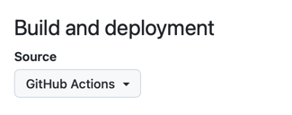

# docs-builder

You've reached the home of the latest incarnation of the documentation tooling.

This repository is host to:

* *`docs-builder`* command line tool to generate single doc-sets (13mb native code, no dependencies)
* *`docs-assembler`* command line tool to assemble all the doc sets. (IN PROGRESS)
* `elastic/docs-builder@main` Github Action to build and validate a repositories documentation

## Command line interface

```bash
$ docs-builder --help
Usage: [command] [options...] [-h|--help] [--version]

Converts a source markdown folder or file to an output folder

Options:
  -p|--path <string?>        Defaults to the`{pwd}/docs` folder (Default: null)
  -o|--output <string?>      Defaults to `.artifacts/html` (Default: null)
  --path-prefix <string?>    Specifies the path prefix for urls (Default: null)
  --force <bool?>            Force a full rebuild of the destination folder (Default: null)

Commands:
  generate    Converts a source markdown folder or file to an output folder
  serve       Continuously serve a documentation folder at http://localhost:3000.
    File systems changes will be reflected without having to restart the server.
```

In the near term native code will be published by CI for the following platforms

| OS       | Architectures |
|----------|---------------|
| Windows	 | x64, Arm64    |
| Linux	   | x64, Arm64    |
| macOS    | 	x64, Arm64   |

And we'll invest time in making sure these are easily obtainable (`brew`, `winget`, `apt`)

For now you can run the tool locally through `docker run`

```bash
docker run -v "./.git:/app/.git" -v "./docs:/app/docs" -v "./.artifacts:/app/.artifacts" \
  ghcr.io/elastic/docs-builder:edge
```

This ensures `.git`/`docs` and `.artifacts` (the default output directory) are mounted.

The tool will default to incremental compilation.
Only the changed files on subsequent runs will be compiled unless you pass `--force`
to force a new compilation.

```bash
docker run -v "./.git:/app/.git" -v "./docs:/app/docs" -v "./.artifacts:/app/.artifacts" \
  ghcr.io/elastic/docs-builder:edge --force
```

#### Live mode

Through the `serve` command you can continuously and partially compile your documentation.

```bash
docker run -v "./.git:/app/.git" -v "./docs:/app/docs" -v "./.artifacts:/app/.artifacts" \
  -p 3000:3000 ghcr.io/elastic/docs-builder:edge serve
```

Each page is compiled on demand as you browse http://localhost:3000 and is never cached so changes to files and
navigation will always be reflected upon refresh.

Note the docker image is `linux-x86` and will be somewhat slower to invoke on OSX due to virtualization.


## Github Action

The `docs-builder` tool is available as github action.

Since it runs from a precompiled distroless image `~25mb` it's able to execute snappy. (no need to wait for building the tool itself)


```yaml
jobs:
  docs:
    runs-on: ubuntu-latest
    steps:
      - uses: actions/checkout@v4
      - name: Build documentation
        uses: elastic/docs-builder@main
```


### GitHub Pages

To set up the tool to publish to GitHub pages use the following configuration.
**NOTE**: In the near feature we'll make this a dedicated single step GitHub action

```yaml
environment:
  name: github-pages
  url: ${{ steps.deployment.outputs.page_url }}
steps:
  - uses: actions/checkout@v4
    
  - name: Publish Github
    uses: elastic/docs-builder/actions/publish@main
    id: deployment
```

Make sure your repository settings are set up to deploy from GitHub actions see:

https://github.com/elastic/{your-repository}/settings/pages

---


---

## Run without docker

You can use the .NET CLI to publish a self-contained `docs-builder` native code
binary. (On my M2 Pro mac the binary is currently 16mb)

Install [.NET 9.0](https://dotnet.microsoft.com/en-us/download/dotnet/9.0), then run:

```bash
dotnet publish "src/docs-builder/docs-builder.csproj"
```

The resulting binary `./.artifacts/publish/docs-builder/release/docs-builder` will run on machines without .NET installed.

# Performance

To test performance it's best to build the binary and run outside of docker:

For reference here's the `markitpy-doc` docset (50k markdown files) currently takes `14s` vs `several minutes` compared to
existing surveyed tools

# Local Development

## Preqrequisites

- [.NET 9.0 SDK](https://dotnet.microsoft.com/en-us/download/dotnet/9.0)
- [Node.js 22.13.1 (LTS)](https://nodejs.org/en/blog/release/v22.13.1)


## Continuously build all assets during development.

```shell
./build.sh watch
```

This will monitor code, cshtml template files & static files and reload the application
if any changes.

Web assets are reloaded through `parcel watch` and don't require a recompilation.

Markdown files are refreshed automatically through livereload

Code or layout changes will relaunch the server automatically

# Release Process

This section outlines the process for releasing a new version of this project.

## Versioning

This project uses [Semantic Versioning](https://semver.org/) and its version is
automatically determined by [release-drafter](https://github.com/release-drafter/release-drafter)
based on the labels of the pull requests merged into the `main` branch.

See the [release-drafter configuration](./.github/release-drafter.yml) for more details.

## Creating a New Release

Every time a pull request is merged into the `main` branch, release-drafter will
create a draft release or update the existing draft release in the [Releases](https://github.com/elastic/docs-builder/releases) page.

To create a new release you need to publish the existing draft release created by release-drafter.

> [!IMPORTANT]
> Make sure the [release-drafter workflow](https://github.com/elastic/docs-builder/actions/workflows/release-drafter.yml) is finished before publishing the release.

> [!NOTE]
> When a release is published, the [create-major-tag workflow](./.github/workflows/create-major-tag.yml)
> will force push a new major tag in the format `vX` where `X` is the major version of the release.
> For example, if the release is `1.2.3` was published, the workflow will force push a new tag `v1` on the same commit.
