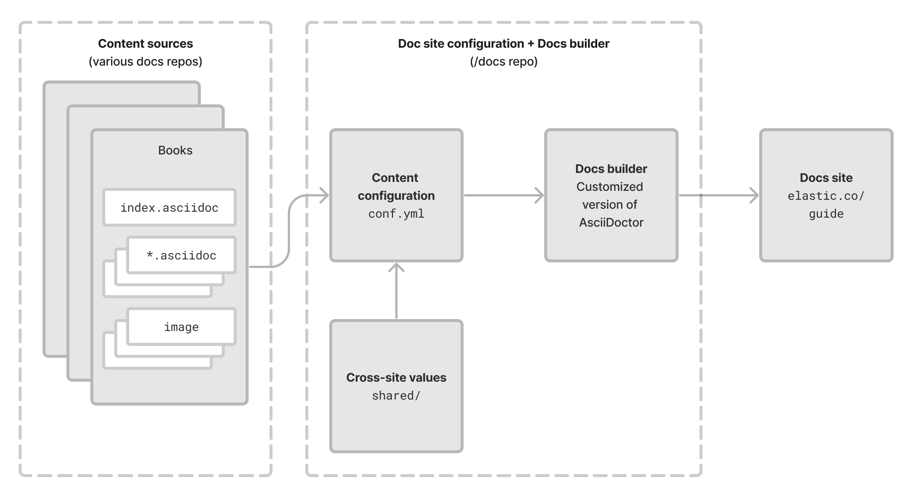

# Site-level configuration

Start by understanding how the new V3 system works at the site level compared to how our custom AsciiDoctor system works. At the site-level, we have:

| System property | Asciidoc | V3 |
| -------------------- | -------------------- | -------------------- |
| **Content sources** --> Collections of markup files containing doc content. These are split up across many docs repos. | _Books_ | _Content sets_ |
| **Content configuration** --> A way to specify where to find those content sources, and in what order they should be added to the site. | Configuration file ([`conf.yml`](https://github.com/elastic/docs/blob/master/conf.yaml) in elastic/docs) | Config file `assembler.yml` |

Where these pieces live and what format they are in varies between the two systems, but they generally achieve the same goal.

## Content sources

TBD

## Content configuration

In both the AsciiDoctor- and V3-based system, there is site-wide configuration where you list all content sources, where to find those sources, and in what order they should be added to the site.

In the AsciiDoctor system, this all happens in one YAML file in the `/docs` repo. In the V3 system, this happens in the `assembler.yml` file in `docs-content`.

[assembler.yml](./content.md)

## Landing page

See [landing page](./landing-page.md)

## Redirects

Plan still needed

## V3 site-level diagram

DIAGRAM NEEDED

## Asciidoc site-level diagram

