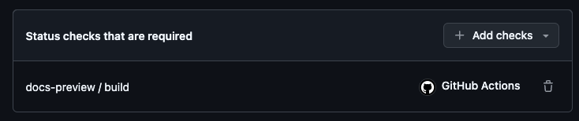

# How to set up docs previews

This guide will help you set up docs previews for your GitHub repository.

## GitHub Workflows

The docs preview system consists of two GitHub Workflows:
- [`docs-build.yml`](#build): **Build** the docs on a PR
- [`docs-cleanup.yml`](#cleanup): **Cleanup** the docs after a PR is merged or closed


### Build

This workflow is triggered when a PR is opened. The underlying reusable workflow, builds the documentation and uploads it as an artifact.
If the `path-pattern` input does not match any changes in the PR, the workflow will skip the build, but still set a green status check.
This way you only build and deploy the docs when there are changes to the docs and you can still set it as a required status check.


::::{tab-set}

:::{tab-item} .github/workflows/docs-build.yml

```yaml
---
name: docs-build

on:
  push:
    branches: 
        - main <1>
  pull_request_target: ~

jobs:
  docs-preview:
    uses: elastic/docs-builder/.github/workflows/preview-build.yml <2>
    with:
      path-pattern: docs/** <3>
    permissions:
      id-token: write
      deployments: write
      contents: read
      pull-requests: read
```

1. You need to adjust this to your default branch. E.g `main`, `master`, etc.
2. Reusable workflow: [elastic/docs-builder/.github/workflows/preview-build.yml](https://github.com/elastic/docs-builder/blob/main/.github/workflows/preview-build.yml)
3. his should be the path to your docs folder.

:::

::::


### Cleanup

This workflow is triggered when a PR is either merged or closed. The underlying reusable workflow, deletes the docs from the preview environment.

:::{note}
We are aware of the security implications of using `pull_request_target` as described in [this blog post](https://securitylab.github.com/resources/github-actions-preventing-pwn-requests/).
The workflow never checks out the code and doesn't use any user modifiable inputs (e.g. PR title). 
:::

::::{tab-set}

:::{tab-item} .github/workflows/docs-cleanup.yml

```yaml
---
name: docs-cleanup

on:
  pull_request_target:
    types:
      - closed

jobs:
  docs-preview:
    uses: elastic/docs-builder/.github/workflows/preview-cleanup.yml <1>
    permissions:
      contents: none <2>
      id-token: write
      deployments: write
```

1. Reusable workflow: [elastic/docs-builder/.github/workflows/preview-cleanup.yml](https://github.com/elastic/docs-builder/blob/main/.github/workflows/preview-cleanup.yml)
2. No permissions to read content

:::

::::

## Required Status Checks

To ensure that the docs are always in a deployable state, we need to set up required status checks.

In this case only the `docs-build` workflow is required, which will produce a status check named `docs-preview / build`.




## Deployments

If the `docs-build` workflow is successful, the `docs-deploy` workflow will create a deployment visible in the GitHub UI on your PR.


