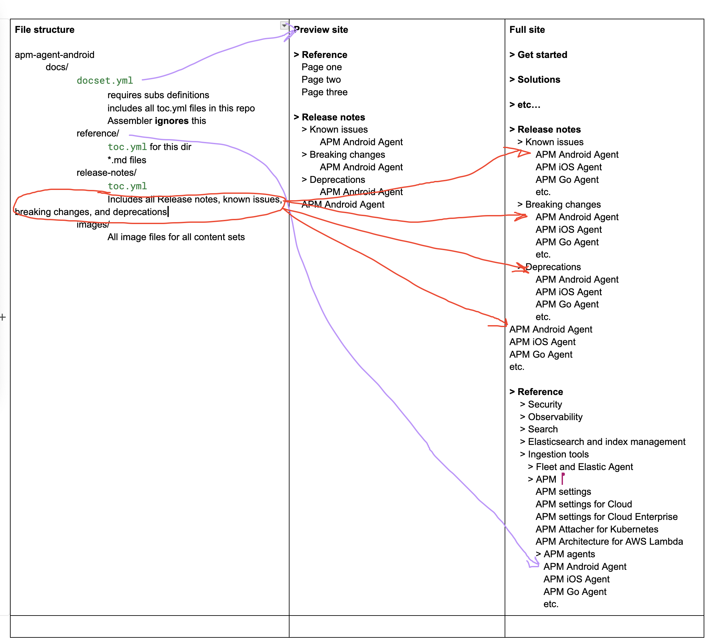

# Move reference docs from Asciidocalypse

:::{note}
This guide is only for technical writers tasked with moving content out of `elastic/asciidocalypse`.
:::

## How reference content works in V3

There are two use cases for building reference content in V3:
- **Preview builds**
- **elastic.co/docs builds**

Some repositories, like [`elastic/elastic-serverless-forwarder`](https://github.com/elastic/elastic-serverless-forwarder), contain a single chunk of content within the larger `elastic.co/docs` build. This means the structure of the content is the same for both preview builds and the final Elastic.co/docs build.

However, most repositories contain content that will live in multiple locations within the new `elastic.co/docs` IA. Consider `apm-agent-android` as an example. It has the following content:
- Reference docs
- Release notes
- Known issues
- Breaking changes
- Deprecations

### Directory Structure

Release notes do **not** require individual `toc.yml` files for each content set. The directory structure for `apm-agent-android` therefore follows this format:

```md
docs/
    `docset.yml`
        * Defines substitutions
        * Includes all `toc.yml` files in this repo
        * Ignored by the assembler
    reference/
        `toc.yml` (for this directory)
        All reference `.md` files go here
    release-notes/
        `toc.yml` (for this directory)
        All release notes, known issues, breaking changes, and deprecations files go here
    images/
        All image files for all content sets
```

### Preview Site vs. Full Site Structure

For individual repository preview builds, **all** content in the `docs/` directory builds together, appearing as:

```md
> Reference
   Page one
   Page two
   Page three

> Release notes
   > Known issues
          APM Android Agent
   > Breaking changes
          APM Android Agent
   > Deprecations
          APM Android Agent
   APM Android Agent release notes
```

This structure is defined in the repo's `docset.yml` file.

For the **full Elastic.co/docs site**, the assembler references the individual content set definitions (`toc.yml`) within the repo and organizes the content accordingly:



## How to Move Reference Content

The steps below explain how to move reference content. You can also take a look at our [sample PR](https://github.com/elastic/apm-agent-android/pull/398), which has specific commits to illustrate some of the steps below.

### Step 1: Delete Existing AsciiDoc Files

:::{important}
Skip this step for **any Cloud repos** and the **search-ui repository**.
:::

Ensure you only delete **external documentation files**.  
- In some repositories, this means deleting the entire `/docs` directory.  
- In others, manually verify which files should be removed.  
- Use [`conf.yaml`](https://github.com/elastic/docs/blob/master/conf.yaml) to determine what should and shouldn't be removed.

Example commit: [#398/commit](https://github.com/elastic/apm-agent-android/pull/398/commits/749803ae9bccdb9f8abdf27a5c7434350716b6c0)

### Step 2: Copy and Paste New Content

Move content from `asciidocalypse` to the correct directory in the target repo.  
Use [issue#130](https://github.com/elastic/docs-eng-team/issues/130) to determine the correct path structure.

Example commit: [#398/commit](https://github.com/elastic/apm-agent-android/pull/398/commits/3f966b0e1fa2f008da23d02f2c9e91a60c1bdf8d)

### Step 3: Add the new CI checks

**docs-build**
* The file to add: [`github/workflows/docs-build.yml`](https://github.com/elastic/docs-content/blob/main/.github/workflows/docs-build.yml)
* The path and name of the new file: `.github/workflows/docs-build.yml`

**docs-cleanup**
* The file to add: [`.github/workflows/docs-cleanup.yml`](https://github.com/elastic/docs-content/blob/main/.github/workflows/docs-cleanup.yml)
* The path and name of the new file: `.github/workflows/docs-cleanup.yml`

Example commit: [#398/commit](https://github.com/elastic/apm-agent-android/pull/398/commits/e869386bbf4af23d51432226f1fd3935d233e43d)

### Step 4: Delete the asciidoc warning

:::{important}
Skip this step for **any Cloud repos** and the **search-ui repository**.
:::

During the migration freeze, we added a check to each repository that warned when a PR was opened against asciidoc files in `main`. It is now safe to remove this file.

File to delete: `.github/workflows/comment-on-asciidoc-changes.yml`

Example commit: [#398/commit](https://github.com/elastic/apm-agent-android/pull/398/commits/be422934e79c5ecadd7b76523d2e1676fc86f323)

### Step 4: Wait for CI to Pass

Verify that all automated checks pass before proceeding. If you encounter any linking failures and need help resolving them, reach out in the typical docs channels.

### Step 5: Merge the PR

Once everything is confirmed working, merge the pull request.

### Step 6: Update the Tracking Issue

Update [issue#130](https://github.com/elastic/docs-eng-team/issues/130) to reflect the completed migration.
