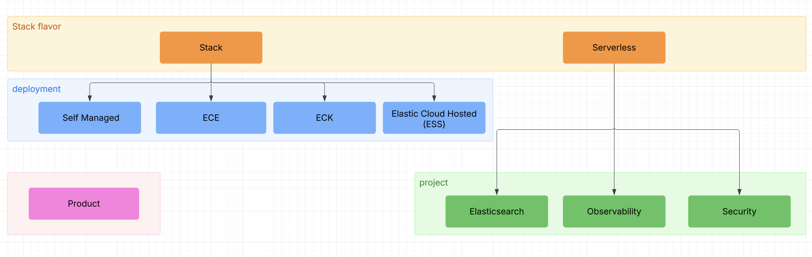

---
applies_to:
  stack: ga 9.1
  deployment:
    eck: ga 9.0
    ess: beta 9.1
    ece: discontinued 9.2.0
    self: unavailable 9.3.0
  serverless:
    security: ga 9.0.0
    elasticsearch: beta 9.1.0
    observability: discontinued 9.2.0
  product: coming 9.5, discontinued 9.7
---

# Applies to

Allows you to annotate a page or section's applicability.

### Syntax

```
<life-cycle> [version], <life-cycle> [version]
```

Taking a mandatory [life-cycle](#life-cycle) with an optional version.

#### Life cycle:
  * `preview`
  * `beta`
  * `development`
  * `deprecated`
  * `coming`
  * `discontinued`
  * `unavailable`
  * `ga`

#### Version

Can be in either `major.minor` or `major.minor.patch` format

#### Examples

```
coming 9.5, discontinued 9.7
discontinued 9.2.0
all
```

`all` and empty string mean generally available for all active versions

```yaml
applies_to:
  serverless: all
```

`all` and empty string can also be specified at a version level

```yaml
applies_to:
  stack: beta all
  serverless: beta
```

Both are equivalent, note `all` just means we won't be rendering the version portion in the html.


## Structured model



The above model is projected to the following structured yaml.

```yaml
---
applies_to:
  stack: 
  deployment:
    eck: 
    ess: 
    ece: 
    self: 
  serverless:
    security: 
    elasticsearch: 
    observability: 
  product: 
---
```
This allows you to annotate various facets as defined in [](../migration/versioning.md)

## Page annotations

Using yaml frontmatter pages can explicitly indicate to each deployment targets availability and lifecycle status


```yaml
---
applies_to:
  stack: ga 9.1
  deployment:
    eck: ga 9.0
    ess: beta 9.1
    ece: discontinued 9.2.0
    self: unavailable 9.3.0
  serverless:
    security: ga 9.0.0
    elasticsearch: beta 9.1.0
    observability: discontinued 9.2.0
  product: coming 9.5, discontinued 9.7
---
```


## Section annotation [#sections]

```yaml {applies_to}
stack: ga 9.1
deployment:
  eck: ga 9.0
  ess: beta 9.1
  ece: discontinued 9.2.0
  self: unavailable 9.3.0
serverless:
  security: ga 9.0.0
  elasticsearch: beta 9.1.0
  observability: discontinued 9.2.0
product: coming 9.5, discontinued 9.7
```

A header may be followed by an `{applies_to}` directive which will contextualize the applicability 
of the section further.

:::{note}
the `{applies_to}` directive **MUST** be preceded by a heading directly.
:::


Note that this directive needs triple backticks since its content is literal. See also [](index.md#literal-directives)

````markdown
```{applies_to}
stack: ga 9.1
```
````

In order to play even better with markdown editors the following is also supported:

````markdown
```yaml {applies_to}
stack: ga 9.1
```
````

This will allow the yaml inside the `{applies-to}` directive to be fully highlighted.


## Examples

#### Stack only
```yaml {applies_to}
stack: ga 9.1
```

#### Stack with deployment
```yaml {applies_to}
stack: ga 9.1
deployment:
  eck: ga 9.0
  ess: beta 9.1
```

#### Deployment only
```yaml {applies_to}
deployment:
  ece: discontinued 9.2.0
  self: unavailable 9.3.0
```

#### Serverless only
```yaml {applies_to}
serverless: ga 9.0.0
```

#### Serverless with project differences
```yaml {applies_to}
serverless:
  security: ga 9.0.0
  elasticsearch: beta 9.1.0
  observability: discontinued 9.2.0
```
#### Stack with product
```yaml {applies_to}
stack: ga 9.1
```
