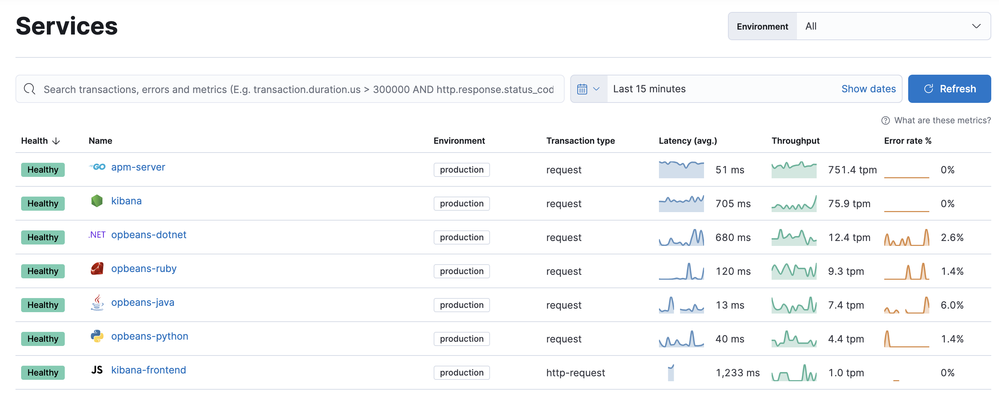
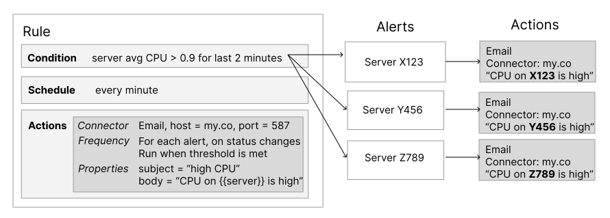

# Images

Images include screenshots, inline images, icons, and more. Syntax for images is like the syntax for links, with two differences:
1. instead of link text, you provide an image description
2. an image description starts with `![` not just `[`

Images can be referenced from the top-level `_static` dir or a local image dir.

## Screenshots

Screenshots are images displayed with a box-shadow.

:::{warning}
This feature is not currently supported in Elastic Docs V3.
:::

## Block-level images

```markdown

```


Or, use the `image` directive.

```markdown
:::{image} img/observability.png
:alt: Elasticsearch
:width: 250px
:::
```

:::{image} img/observability.png
:alt: Elasticsearch
:width: 250px
:::

## Inline images

```markdown
Here is the same image used inline 
```

Here is the same image used inline 


### Inline image titles

Titles are optional making this the minimal syntax required

```markdown

```

Including a title can be done by supplying it as an optional argument.

```markdown

```

### Inline image sizing

Inline images are supplied at the end through the title argument.

This is done to maintain maximum compatibility with markdown parsers
and previewers. 

```markdown


```

`W` and `H` can be either an absolute number in pixels or a number followed by `%` to indicate relative sizing.

If `H` is omitted `W` is used as the height as well.

```markdown


```


### SVG 

```markdown

```


### GIF

```markdown

```


## Asciidoc syntax

```asciidoc
[role="screenshot"]
image::images/metrics-alert-filters-and-group.png[Metric threshold filter and group fields]
```

```asciidoc
image::images/synthetics-get-started-projects.png[]
```